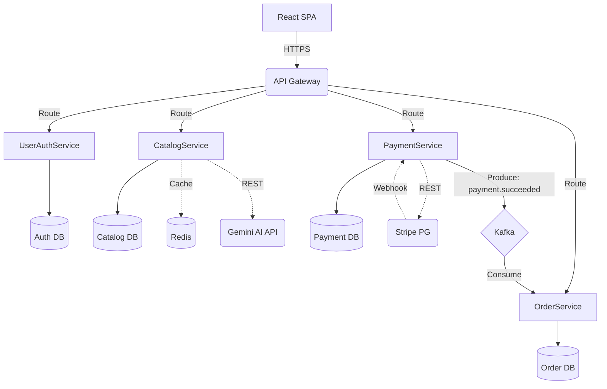

# Neovarsity Capstone Project Report

**Candidate Name:** Ajay Dilip Kharat
**Project Guide / Supervisor:** Naman Bhalla
**Date:** [Date]

## DECLARATION
I confirm that this project report, submitted to fulfill the requirements for the Master of Science in Computer Science degree, completed by me from [Start Date] to [End Date], is the result of my own individual endeavor. The Project has been made on my own under the guidance of my supervisor with proper acknowledgement and without plagiarism. Any contributions from external sources or individuals, including the use of AI tools, are appropriately acknowledged through citation. By making this declaration, I acknowledge that any violation of this statement constitutes academic misconduct. I understand that such misconduct may lead to expulsion from the program and/or disqualification from receiving the degree.

**Signature of the Candidate:** _________________

## ACKNOWLEDGMENT
[Gratitude to family, Scaler instructors, etc.]

## Abstract
This project presents a highly scalable, resilient, and modern E-commerce backend system built using a Microservices architecture. It demonstrates the real-life application of distributed systems by breaking down an e-commerce platform into dedicated Spring Boot microservices (Auth, Catalog, Order, Payment) integrated via Spring Cloud API Gateway. The system addresses common industry challenges like asynchronous processing via Apache Kafka, high-performance caching using Redis, secure payment reconciliation using Stripe webhooks, and AI-augmented development through the integration of the Gemini AI API for semantic product search. This backend-heavy system is deployed on AWS (EC2, RDS, VPC) and perfectly meets the rigor expected for enterprise-grade backend engineering.

## Project Description
The objective of this Capstone Project is to build a complete backend E-commerce system from scratch, employing advanced backend engineering concepts and SOLID design principles. The relevance of this project lies in its strict adherence to modern microservice patterns: "Database per Microservice" to ensure decoupled schemas, centralized JWT authentication at the API Gateway for security, and asynchronous state transitions using Kafka to guarantee resilience during payment workflows.

Below is the high-level system architecture and deployment topology.

**Figure 1.1**: E-commerce Microservices Topology

## Requirement Gathering
**Functional Requirements:**
1. **UserAuthService:** Secure user registration, JWT generation, and OAuth2 integration.
2. **CatalogService:** Paginated product listing and AI Semantic Search (natural language queries via Gemini API).
3. **OrderService:** Cart operations and Order lifecycle management.
4. **PaymentService:** Stripe PG integration and asynchronous webhook reconciliation via Kafka.

**Non-Functional Requirements:**
1. **Resilience:** Graceful fallback to SQL keyword search if the Gemini API fails.
2. **Performance:** Redis caching for sub-100ms catalog query responses.
3. **Security:** Centralized JWT validation at the API Gateway.

**Users and Use Cases:**
- *Shoppers:* Can securely log in, search for products using semantic meaning, add items to cart, and process checkout.
- *System Admins:* Can monitor asynchronous events flowing through Kafka.

**Table 1.1**: Core Feature Set
| Feature | Microservice | Description |
|---|---|---|
| JWT Auth | UserAuthService | Stateless authentication validated at API Gateway. |
| Semantic Search | CatalogService | Uses Gemini AI to understand shopper intent. |
| Cart & Checkout | OrderService | Manages pending orders prior to payment. |
| Stripe Webhooks | PaymentService | Receives Stripe callbacks and fires Kafka events. |

## Class Diagrams
[Low Level Design. Class diagrams with proper captions.]

## Database Schema Design
Following the **Database per Microservice** pattern, the database is strictly segregated so services do not share tables.

**Textual Schema Description:**
- **Auth DB (MySQL):** `users` table containing id (UUID), email, bcrypt_password, role.
- **Catalog DB (MySQL):** `products` table containing id, name, description, price, stock_quantity.
- **Order DB (MySQL):** `orders` table (id, user_id, total_amount, status) and `order_items` table.
- **Payment DB (MySQL):** `transactions` table containing id, order_id, stripe_session_id, status.

## Feature Development Process
[Pick one key feature and talk about its development process, implementation, MVC flow, API payload, and performance optimization.]

## Deployment Flow
[Explain deployment via AWS: EC2, VPC, Security Groups, RDS, Cache, etc.]

## Technologies Used
**Spring Boot & Spring Cloud:** Used to build the core microservices and API Gateway. Chosen for its robust ecosystem for distributed systems.
**Apache Kafka:** Used for asynchronous communication (e.g., Order and Payment decoupling). Ensures messages are not lost if a service goes down.
**Redis:** Used to cache the product catalog, significantly reducing database load and speeding up API response times.
**MySQL (RDS):** The relational database used, following the Database-per-service pattern for isolation.
**Gemini AI API:** Used to implement Semantic Product Search, enabling natural language shopping queries.
**Stripe:** Used for secure Payment Gateway processing and webhook reconciliations.
**AWS (EC2, VPC):** The infrastructure used to deploy the backend, ensuring a secure private subnet for microservices while exposing only the API Gateway to the public.

## Conclusion
[Key Takeaways, Practical Applications, Limitations.]

## References
[List of websites, works referred]
